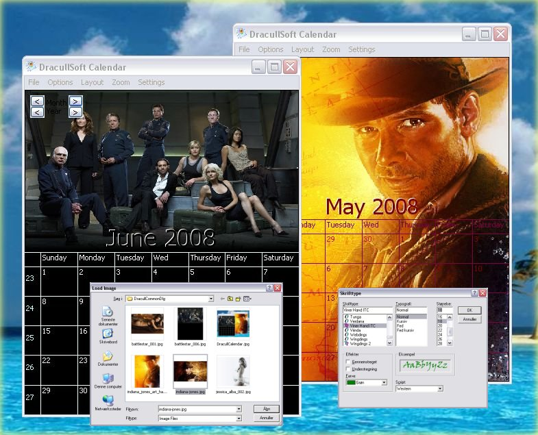



## Dracull Printing and Thumbnail Common Dialogs

### Description

Learn how to use the cCommonDlg class to open and save via common dialogs 32 starting in Thumbnail view mode and page setup and printing to scale.

There are many different examples of doing custom open dialogs with preview for images but the thumbnail view quite fast and will allow you to browse the entire folder.

This project contains an update to Steve's all in one class but with support of 2000 / XP / Vista. I have added ability to set initial view for Open and Save for example to show thumbnails.

Also added methods to get papersize: GetPaperMeasure, GetPaperSizeX, and GetPaperSizeY

Based on work by Steve McMahon and Bruce McKinney and VBnet, Randy Birch.

Example based on : Clint LaFevers "vb Calendar Maker".

This was made for DracullCalendar - a Showcase Application that allow you to create and print Monthly Calendars, but I cleaned out the calendar functionality to make it simpler to follow the Common Dialogs examples.

You can find Clints original submission here:

http://www.Planet-Source-Code.com/vb/scripts/ShowCode.asp?txtCodeId=42227&amp;lngWId=1

Comments and Votes appreciated :)
 
### More Info
 

             |
---                |---
**Submitted On**   |2008-06-01 20:17:08
**By**             |[DracullSoft](https://github.com/Planet-Source-Code/PSCIndex/blob/master/ByAuthor/dracullsoft.md)
**Level**          |Advanced
**User Rating**    |5.0 (15 globes from 3 users)
**Compatibility**  |VB 5\.0, VB 6\.0
**Category**       |[Custom Controls/ Forms/  Menus](https://github.com/Planet-Source-Code/PSCIndex/blob/master/ByCategory/custom-controls-forms-menus__1-4.md)
**World**          |[Visual Basic](https://github.com/Planet-Source-Code/PSCIndex/blob/master/ByWorld/visual-basic.md)
**Archive File**   |[Dracull\_Pr2116176112008\.zip](https://github.com/Planet-Source-Code/dracullsoft-dracull-printing-and-thumbnail-common-dialogs__1-70636/archive/master.zip)

